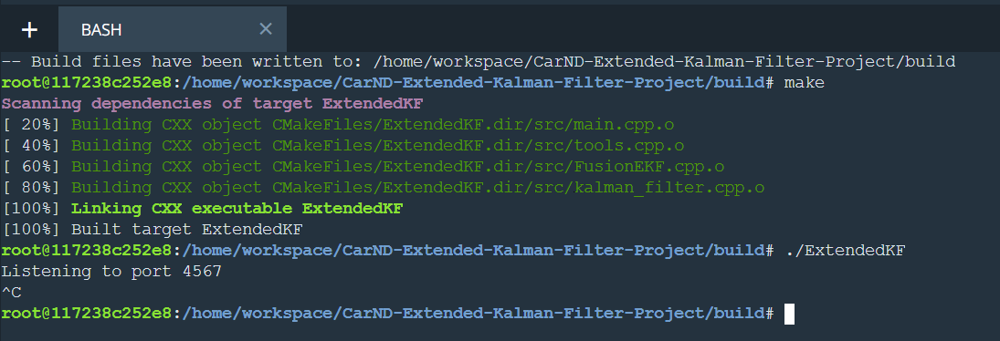
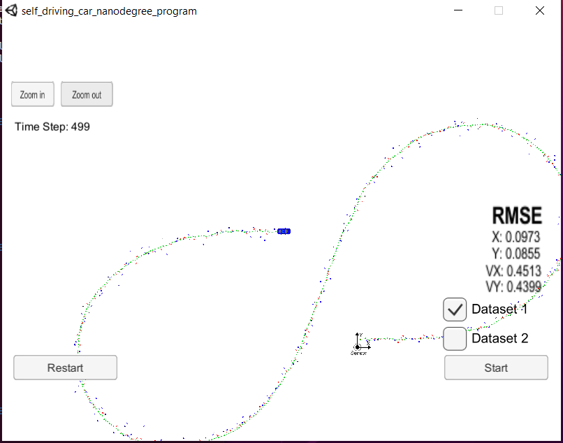
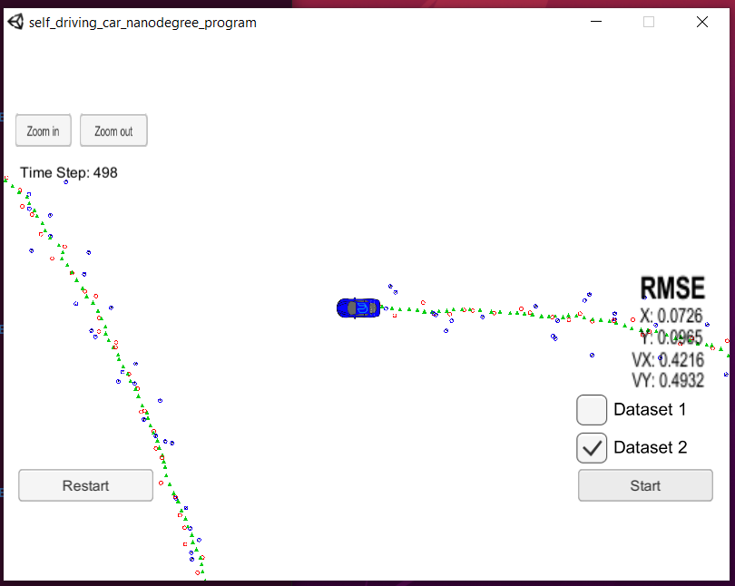

## Extended Kalman Filter Project

### Self-Driving Car Engineer Nanodegree Program [](http://www.udacity.com/drive)

#### Project implemeneted by YIvanov.

Original read.me file and more detailed instruction related to project can be [found here](https://github.com/udacity/CarND-Extended-Kalman-Filter-Project).

I this project I've implemented Extended Kalman Filters, according to information that has been provided in corresponded course.

Following [rubric points](https://review.udacity.com/#!/rubrics/748/view) has been addressed.

# Compiling

Project should be build inside workspace environment with following commands:
```bash
git clone https://github.com/Yuiry-IV/CarND-Extended-Kalman-Filter-Project.git
cd CarND-Extended-Kalman-Filter-Project
mkdir build
cd build
cmake ..
make
./ExtendedKF
```
Please, take a look provided screenshot:


# Accuracy

RMSE of 1st dataset is [0.097, 0.086, 0.45, 0.44]


RMSE of 2nd dataset is [0.073, 0.097, 0.42, 0.49]


Accuracy for 1st and 2nd dataset are matched to requirements.

# Follows the Correct Algorithm

##  Sensor Fusion algorithm follows the general processing flow as taught in the preceding lessons
1. RMSE calculation has been implemented based on class 23: [tools.cpp](./src/tools.cpp) lines 6-19

1. Jacobian calculation has been implemented based on class 19: [tools.cpp](./src/tools.cpp) lines 44-68

1. Extended Kalman Filter algorithm has been implemented based on class 7-13:
* [kalman_filter.cpp](./src/kalman_filter.cpp)
* [FusionEKF.cpp](./src/FusionEKF.cpp)

## Kalman Filter algorithm handles the first measurements appropriately.
First measurement handling has been implemented in [FusionEKF.cpp](./src/FusionEKF.cpp) lines 16-112

## Kalman Filter algorithm first predicts then updates.

Prediction has been called before update. Please, take a look:
* [FusionEKF.cpp](./src/FusionEKF.cpp) lines 152 for Predict
* [FusionEKF.cpp](./src/FusionEKF.cpp) lines 166,169 for Update

## Kalman Filter can handle radar and lidar measurements.

Radar and Lidar (laser) measurement has been handled in [FusionEKF.cpp](./src/FusionEKF.cpp):
* Lines 164-166: Radar
* lines 169: Laser

# Code Efficiency

Small code improvement has bee introduced:
* tools has been changed to namespace because tools has not been contain any state
* Measurement and measurement covariance matrixes has been removed form EKF class as members and passes by Fusion class according to use case as parameters.
* EKF members variables has been made private, to incapsulate EKS state.
* Unneeded variables and methods has been removed. 
